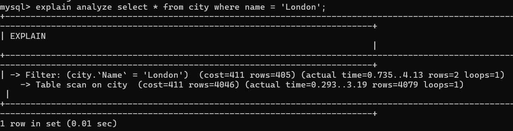
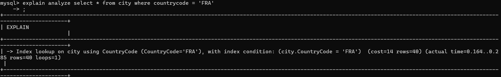
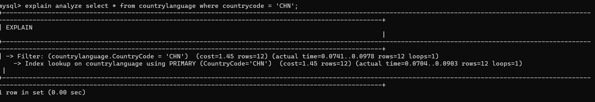
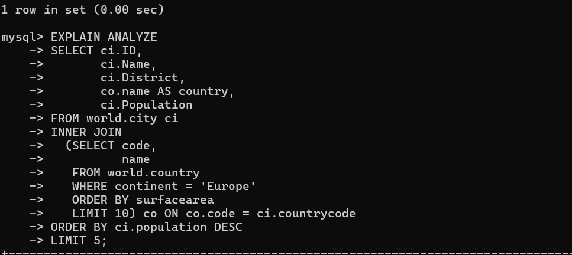
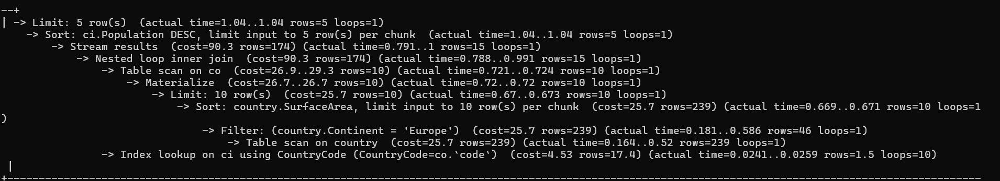

# Database Query Optimization Guide

## Key Takeaways

### Understanding the Optimizer

Before executing a query, MySQL analyzes it to decide whether to perform a full table scan (most expensive) or use an index (typically more efficient).

**Using the EXPLAIN statement:**

Use `EXPLAIN` to view the anticipated execution plan.

**Using the EXPLAIN ANALYZE statement:**

Use `EXPLAIN ANALYZE` to see both the estimation and the actual execution time and row counts, helping to identify where the optimizer might be making poor decisions.

### Index Optimization

**Comparing full table scans versus index lookups:**

**Handling primary key indexes:**

### Query Optimization

**Optimizing complex queries involving subqueries and joins:**

---

## Performance Tips

1. **Compare estimated rows vs. actual rows:** A large discrepancy often indicates a need for updated statistics (run `ANALYZE TABLE`) or better indexing.

2. **Be wary of expressions in WHERE clauses:** The optimizer often cannot use indexes on expressions, leading to inefficient full table scans.

3. **Always account for caching:** Run queries repeatedly to verify if performance gains are due to query optimization or just hot cache behavior.
