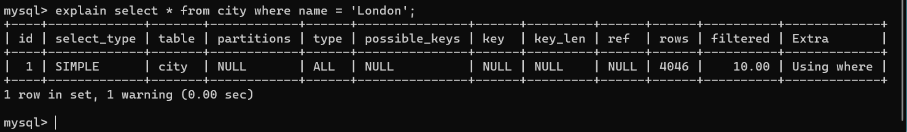

Key Takeaways:
-  Understanding the Optimizer :Before executing a query, MySQL analyzes it to decide whether to perform a full table scan (most expensive) or use an index (typically more efficient).
-  Use EXPLAIN to view the anticipated execution plan.

-  
Use EXPLAIN ANALYZE to see both the estimation and the actual execution time and row counts, helping to identify where the optimizer might be making poor decisions.
Formats for Analysis (3:21 - 6:30): The video discusses different output formats, highlighting the tree-style format as the modern, preferred way to visualize the relationship and order of execution between query subtasks.
Practical Examples: The presenter walks through several scenarios, including:
Comparing full table scans versus index lookups (3:52 - 8:16).
Handling primary key indexes (8:18 - 9:15).
Optimizing complex queries involving subqueries and joins (9:16 - 11:08).
Performance Tips (11:10 - 16:38):
Compare estimated rows vs. actual rows: A large discrepancy often indicates a need for updated statistics (run ANALYZE TABLE) or better indexing.
Be wary of expressions in WHERE clauses (13:46 - 15:20), as the optimizer often cannot use indexes on expressions, leading to inefficient full table scans.
Always account for caching (15:51 - 16:38); run queries repeatedly to verify if performance gains are due to query optimization or just hot cache behavior.
